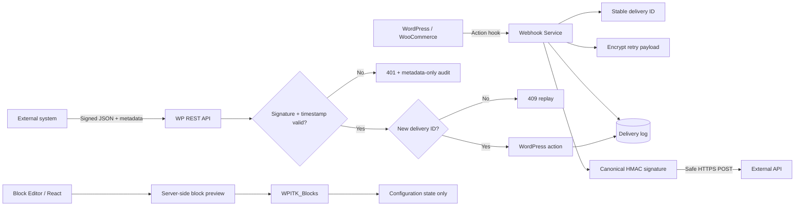

# WP Integration Toolkit

[](https://github.com/DagemawiDeveloper/wordpress-plugin-development-demo/actions/workflows/php-lint.yml)

**An installable WordPress reference plugin for authenticated inbound and outbound webhooks, REST APIs, AJAX administration, a React-based Gutenberg block, encrypted retry payloads, delivery logging, and maintainable PHP architecture.**

The project is deliberately focused on the failure-prone parts of integrations: authenticating callbacks, preventing replay, preserving a stable delivery ID across retries, keeping secrets out of the browser, avoiding unsafe outbound destinations, retaining useful metadata without storing sensitive payloads, and exposing integration state safely to content editors.

## What this project demonstrates

- Installable WordPress plugin structure and lifecycle
- Custom dynamic Gutenberg block with React/Block Editor components
- `block.json` metadata and PHP `render_callback`
- Inspector controls and live `ServerSideRender` preview
- Signed inbound and outbound webhooks
- Canonical HMAC-SHA256 authentication covering timestamp, delivery ID, event, and raw body
- Timestamp expiry and database-enforced replay protection
- AES-256-GCM secret and outbound retry-payload encryption
- Backward-compatible reading of the earlier authenticated AES-CBC format
- Fail-closed behavior when secure cryptography is unavailable
- Public HTTPS endpoint validation and `wp_safe_remote_post()`
- Custom delivery audit table with stable delivery identifiers
- REST endpoints and WordPress action hooks
- Capability checks, nonces, sanitization, and escaped admin/public output
- GitHub Actions linting, Gutenberg metadata checks, JavaScript syntax checks, and PHPUnit tests on PHP 7.4, 8.2, and 8.3

## Architecture



See [`docs/ARCHITECTURE.md`](docs/ARCHITECTURE.md) for integration design rationale, [`docs/API.md`](docs/API.md) for the webhook protocol, and [`docs/GUTENBERG-BLOCK.md`](docs/GUTENBERG-BLOCK.md) for the block implementation and trade-offs.

## Gutenberg integration-status block

Version 1.2.0 adds `wp-integration-toolkit/integration-status`, a real dynamic block for showing whether the toolkit is configured.

The editor UI uses WordPress's React abstraction (`wp.element`) together with `InspectorControls`, `TextControl`, `ToggleControl`, and `ServerSideRender`. Editors can customize the heading and configured/unconfigured labels while seeing the same PHP-rendered state that visitors will receive.

The frontend deliberately exposes only ready/not-ready state. It does **not** render the configured endpoint, signing secret, retry payloads, or webhook data.

This small plugin intentionally uses WordPress-provided JavaScript packages directly instead of adding a Node build dependency for one block. The trade-off and how I would evolve it for a larger enterprise block suite are documented in [`docs/GUTENBERG-BLOCK.md`](docs/GUTENBERG-BLOCK.md).

## Admin workflow

The plugin adds **Integration Toolkit** to `wp-admin`, where an administrator can:

1. Configure a public HTTPS outbound endpoint.
2. Save a randomly generated signing secret of at least 32 characters.
3. Choose request timeout and signature clock tolerance.
4. Send a real test webhook.
5. Inspect delivery status, response codes, and attempt counts.
6. Retry a failed outbound delivery using its original encrypted payload and stable delivery ID.
7. Copy the inbound REST endpoint.

Secrets are never rendered back into the browser after saving.

## Webhook authentication protocol

Every authenticated request uses four values:

```text
X-WPITK-Timestamp: Unix timestamp
X-WPITK-Delivery: stable unique delivery ID
X-WPITK-Event: lowercase event name
X-WPITK-Signature: hex HMAC-SHA256
```

The canonical signing payload is:

```text
<timestamp>\n<delivery-id>\n<event>\n<exact-raw-body>
```

Example PHP signing code:

```php
$timestamp  = (string) time();
$deliveryId = 'delivery-' . bin2hex(random_bytes(16));
$event      = 'customer.updated';
$body       = json_encode(['customer_id' => 42], JSON_THROW_ON_ERROR);

$canonical = implode("\n", [$timestamp, $deliveryId, $event, $body]);
$signature = hash_hmac('sha256', $canonical, $secret);
```

Inbound requests are rejected when the signature is wrong, required metadata is malformed, the timestamp is outside the configured tolerance, the body exceeds 1 MB, or the delivery ID has already been accepted.

## REST API

### Health

```bash
curl https://example.com/wp-json/wp-integration-toolkit/v1/health
```

### Inbound webhook

```bash
curl -X POST \
  https://example.com/wp-json/wp-integration-toolkit/v1/webhooks/inbound \
  -H 'Content-Type: application/json' \
  -H 'X-WPITK-Event: customer.updated' \
  -H 'X-WPITK-Delivery: delivery-0123456789abcdef' \
  -H 'X-WPITK-Timestamp: 1770000000' \
  -H 'X-WPITK-Signature: <canonical-hmac-sha256>' \
  -d '{"customer_id":42,"status":"active"}'
```

Full details: [`docs/API.md`](docs/API.md).

## Dispatch an outbound webhook

Other plugins can dispatch an event without knowing how HTTP delivery, signing, encryption, logging, or retries are implemented:

```php
do_action(
    'wpitk_send_event',
    'order.created',
    array(
        'order_id' => 123,
        'total'    => 149.99,
    )
);
```

## Security model

- Administrator capability checks.
- AJAX nonces.
- Authenticated canonical request signatures.
- Timing-safe comparison.
- Timestamp expiry.
- Replay prevention through a unique accepted delivery ID.
- AES-256-GCM encryption for secrets and retry payloads.
- No Base64/plaintext crypto fallback.
- Public HTTPS-only outbound endpoints.
- Redirects disabled for outbound webhook delivery.
- Inbound logs retain only size and SHA-256 metadata, not raw payloads.
- Outbound payloads are encrypted at rest for controlled retry behavior.
- Gutenberg block rendering exposes only boolean configuration state, never endpoint or secret values.
- Optional data cleanup on uninstall.

See [`SECURITY.md`](SECURITY.md) for trust boundaries and remaining production considerations.

## Installation

1. Copy this repository into `wp-content/plugins/wp-integration-toolkit`.
2. Activate **WP Integration Toolkit** in WordPress.
3. Open **Integration Toolkit** in `wp-admin`.
4. Configure a public HTTPS endpoint and a random signing secret of at least 32 characters.
5. Use **Send Test Webhook** to verify connectivity.
6. Optionally insert **Integration Status** from the block editor.

### Requirements

- WordPress 6.0+
- PHP 7.4+
- OpenSSL
- Correctly configured WordPress `AUTH_KEY` and `SECURE_AUTH_SALT`
- HTTPS

## Development and tests

```bash
composer install
composer lint
composer test
node --check blocks/integration-status/index.js
```

The automated suite covers both the security core and the new block boundary:

- Valid canonical signatures.
- Tampered body, event, and delivery metadata.
- Expired timestamps.
- Malformed headers.
- Authenticated encryption round trips.
- Ciphertext tampering.
- Rejection of plaintext and Base64 secret values.
- Gutenberg editor asset/dependency registration.
- Dynamic block registration and render callback wiring.
- Configured and unconfigured status rendering.
- Sanitization/escaping of editor-provided labels.
- Non-disclosure of endpoint and signing-secret values.

The GitHub Actions matrix additionally validates `block.json` identity/API version and checks the editor JavaScript syntax.

WordPress integration behavior should additionally be exercised in a real test site before release. For a larger block suite I would add JavaScript component tests and browser-level Playwright coverage.

## Project structure

```text
wordpress-plugin-development-demo/
├── wp-integration-toolkit.php
├── uninstall.php
├── blocks/
│   └── integration-status/
│       ├── block.json
│       ├── index.js
│       └── style.css
├── includes/
│   ├── class-wpitk-activator.php
│   ├── class-wpitk-admin.php
│   ├── class-wpitk-blocks.php
│   ├── class-wpitk-crypto.php
│   ├── class-wpitk-logger.php
│   ├── class-wpitk-plugin.php
│   ├── class-wpitk-rest-controller.php
│   ├── class-wpitk-webhook-auth.php
│   └── class-wpitk-webhook-service.php
├── tests/
│   ├── bootstrap.php
│   ├── BlocksTest.php
│   ├── CryptoTest.php
│   └── WebhookAuthTest.php
├── assets/
├── docs/
│   └── GUTENBERG-BLOCK.md
├── .github/workflows/php-lint.yml
├── phpunit.xml.dist
├── SECURITY.md
└── LICENSE
```

## Scope

This is a public engineering reference implementation, not a hosted webhook platform. Production deployments should add environment-specific monitoring, retention policies, secret rotation procedures, rate limiting at the edge, and operational alerting.

## Author

**Dagemawi Alemayehu**  
PHP / Laravel / WordPress / API Integration / SaaS Development
