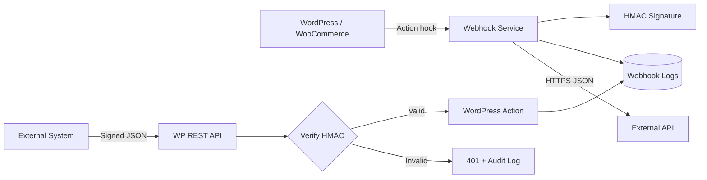

# WP Integration Toolkit

**A production-style WordPress integration plugin demonstrating secure webhooks, REST APIs, AJAX actions, logging, retries, and maintainable PHP architecture.**

Built as a public engineering showcase for real-world WordPress plugin and integration work—not as a hello-world example.

## What this project demonstrates

- Custom WordPress plugin architecture in PHP
- Signed outbound webhooks with HMAC-SHA256
- Authenticated inbound REST API webhooks
- Encrypted secret storage
- Custom database table + delivery audit trail
- AJAX-based testing and retry workflows
- WordPress capabilities, nonces, sanitization and escaping
- Hooks/actions for integration with WooCommerce or other plugins
- Responsive wp-admin UI
- GitHub Actions PHP linting

## Typical problems this pattern solves

This architecture is useful when a WordPress site needs to reliably communicate with a CRM, SaaS platform, marketplace service, ERP, email platform or custom backend.

Examples include:

- Sending order/customer events from WooCommerce to another system
- Receiving status callbacks from an external service
- Diagnosing integration failures instead of silently losing requests
- Retrying failed webhook deliveries
- Providing plugin-level integration code without editing a theme
- Securing API callbacks with signed payloads

## Architecture



See [`docs/ARCHITECTURE.md`](docs/ARCHITECTURE.md) for the design rationale.

## Admin workflow

The plugin adds **Integration Toolkit** to wp-admin where an administrator can:

1. Configure an outbound webhook URL.
2. Store a signing secret without exposing it back to the browser.
3. Set an HTTP timeout.
4. Send a real test webhook over AJAX.
5. Inspect inbound/outbound delivery history.
6. Retry failed outbound deliveries.
7. Copy the inbound REST endpoint for external systems.

## REST API

### Health

```bash
curl https://example.com/wp-json/wp-integration-toolkit/v1/health
```

### Inbound webhook

```bash
curl -X POST \
  https://example.com/wp-json/wp-integration-toolkit/v1/webhooks/inbound \
  -H 'Content-Type: application/json' \
  -H 'X-WPITK-Event: customer.updated' \
  -H 'X-WPITK-Signature: <hmac-sha256>' \
  -d '{"customer_id":42,"status":"active"}'
```

Full details: [`docs/API.md`](docs/API.md).

## Dispatch an outbound webhook from another plugin

```php
do_action(
    'wpitk_send_event',
    'order.created',
    array(
        'order_id' => 123,
        'total'    => 149.99,
    )
);
```

The calling plugin does not need to know how signing, HTTP delivery or logging is implemented.

## Security controls

- Admin capability checks
- AJAX nonces
- HMAC webhook signatures
- Timing-safe signature verification
- Sanitized settings
- Escaped admin output
- Shared secret encrypted at rest
- Optional cleanup on uninstall

See [`SECURITY.md`](SECURITY.md).

## Installation

1. Copy this repository into `wp-content/plugins/wp-integration-toolkit`.
2. Activate **WP Integration Toolkit** in WordPress.
3. Open **Integration Toolkit** in wp-admin.
4. Configure an endpoint and signing secret.
5. Use **Send Test Webhook** to verify connectivity.

### Requirements

- WordPress 6.0+
- PHP 7.4+
- HTTPS recommended
- OpenSSL recommended for encrypted secret storage

## Project structure

```text
wordpress-plugin-development-demo/
├── wp-integration-toolkit.php
├── uninstall.php
├── includes/
│   ├── class-wpitk-activator.php
│   ├── class-wpitk-admin.php
│   ├── class-wpitk-crypto.php
│   ├── class-wpitk-logger.php
│   ├── class-wpitk-plugin.php
│   ├── class-wpitk-rest-controller.php
│   └── class-wpitk-webhook-service.php
├── assets/
│   ├── css/admin.css
│   └── js/admin.js
├── docs/
│   ├── API.md
│   └── ARCHITECTURE.md
├── .github/workflows/php-lint.yml
├── SECURITY.md
└── CONTRIBUTING.md
```

## Engineering focus

The goal of this repository is to show the kind of code required when a WordPress problem goes beyond plugin configuration and needs debugging at the PHP, REST API, AJAX, database or integration layer.

That includes the same categories of issues commonly found in marketplace plugins, form plugins, WooCommerce extensions and custom WordPress systems.

## Author

**Dagemawi Alemayehu**  
PHP / Laravel / WordPress / API Integration / SaaS Development
