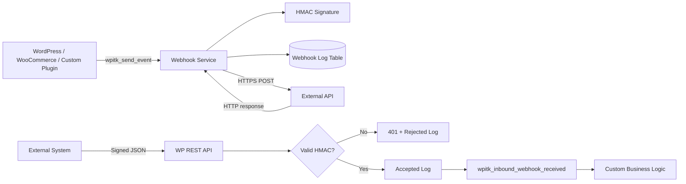

# Architecture

## Design choices

### Service separation
Delivery, logging, encryption, REST routing and admin concerns are separated into focused classes. This keeps integration logic testable and prevents the main plugin bootstrap from becoming a monolith.

### HMAC authentication
Inbound and outbound webhook payloads use HMAC-SHA256 signatures so the receiver can validate message authenticity without exposing the shared secret over the wire.

### Secret-at-rest protection
The shared secret is encrypted before storage using keys derived from WordPress authentication salts. It is never rendered back into the settings page.

### Observability
Each inbound and outbound attempt is persisted with status, HTTP response code, payload metadata and retry count. Failed outbound events can be retried from wp-admin.

### Extensibility
`wpitk_send_event` and `wpitk_inbound_webhook_received` let other plugins integrate without modifying this plugin's source.
