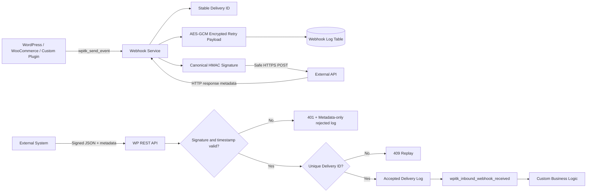

# Architecture



## Design choices

### Focused services

Delivery, authentication, logging, encryption, REST routing, and administration are separated into focused classes. The canonical signature and crypto classes contain no WordPress runtime calls, allowing the security core to be unit tested without bootstrapping WordPress.

### Canonical request authentication

Signing only a JSON body does not authenticate the event name, timestamp, or delivery identity. The plugin therefore signs all security-relevant request metadata plus the exact raw body:

```text
timestamp\ndelivery-id\nevent\nraw-body
```

A receiver can verify authenticity, reject stale requests, and associate every retry with one stable delivery ID.

### Replay prevention

Accepted delivery IDs are stored under a unique database index. The same authenticated delivery can be retried safely by the sender, but WordPress will accept it only once. Invalid signatures are not allowed to reserve a delivery ID.

### Secret and retry-payload protection

New encrypted values use AES-256-GCM with key material derived from WordPress authentication salts. The plugin fails closed when secure cryptography is unavailable. Earlier authenticated AES-CBC values remain readable for upgrade compatibility, but plaintext and Base64-only values are rejected.

Outbound bodies are encrypted in the delivery table so an administrator can retry the exact request without keeping it in plaintext. Inbound bodies are never stored; logs retain only byte count and SHA-256 metadata.

### Safe outbound network boundary

The settings layer and runtime both require a public HTTPS destination. Delivery uses `wp_safe_remote_post()`, disables redirects, sets bounded timeouts, and stores response metadata rather than arbitrary remote content.

### Schema upgrades

`WPITK_Activator::maybe_upgrade()` applies `dbDelta()` when the plugin version changes. Version 1.1 adds the unique `delivery_id` column while preserving the existing log table.

### Extensibility

`wpitk_send_event` and `wpitk_inbound_webhook_received` let other plugins integrate without modifying this plugin's source.

## Remaining production considerations

The repository is a reference implementation. A high-volume production deployment should additionally provide edge rate limiting, retention jobs, centralized monitoring, clock synchronization checks, formal secret rotation, alerting, and workload-specific payload classification.
